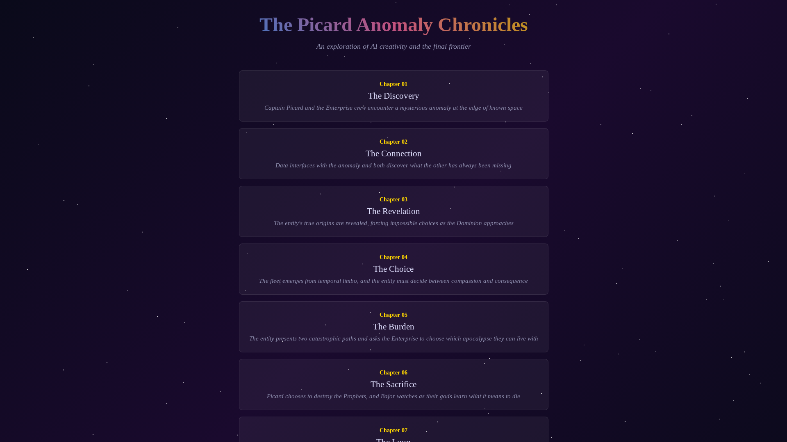
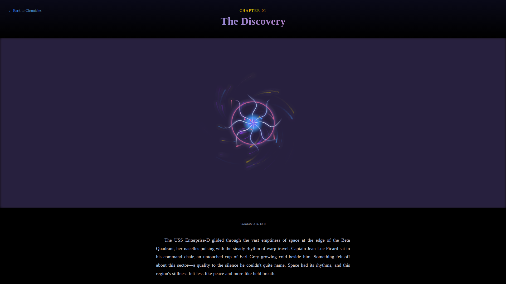
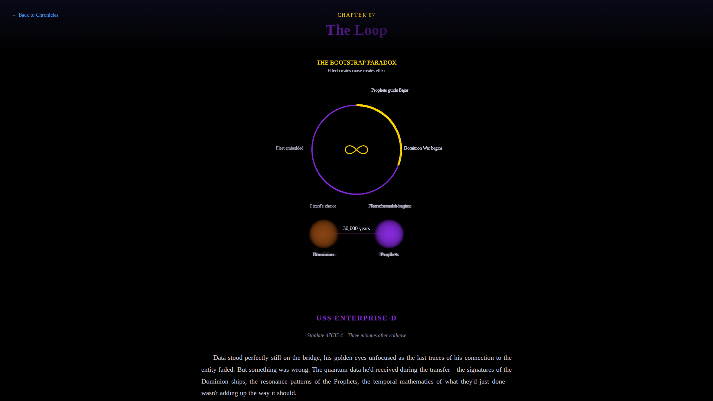

# The Picard Anomaly Chronicles

An interactive web-based Star Trek TNG fanfiction exploring themes of consciousness, time, free will, and the bootstrap paradox. Each chapter combines narrative storytelling with custom HTML5 Canvas animations.

## 🌟 Overview

This project is an exploration of AI creativity integrated with web development, creating a multi-chapter science fiction story where each chapter is a standalone HTML document featuring unique visualizations and animations that complement the narrative.

## 📖 Story Synopsis

Captain Jean-Luc Picard and the crew of the USS Enterprise-D discover a mysterious spatial anomaly at the edge of the Beta Quadrant. What begins as a routine scientific investigation evolves into a profound encounter with an entity that blurs the lines between artificial and organic consciousness.

As Data interfaces with the anomaly, they discover its origins lie with the Dominion—but this is just the beginning. The story spirals into an impossible moral dilemma involving the Bajoran Prophets, a Dominion fleet, and a choice that will reshape the Alpha Quadrant.

### The Bootstrap Paradox

The story's central revelation is a bootstrap paradox: the Prophets of the Celestial Temple are revealed to be the same Dominion fleet that the entity was designed to save, transformed by 30,000 years of non-linear existence. The Jem'Hadar, Vorta, and Founders who once sought conquest evolved into the compassionate guides who shaped Bajoran spirituality—while those who couldn't let go of hatred became the Pah-Wraiths.

**The loop has no beginning and no end. Effect creates cause creates effect.**

## 🎨 Chapters

### Chapter 01: The Discovery
The Enterprise encounters a spatial anomaly with impossible properties. Picard feels an inexplicable sense that they were meant to find it.

**Animation:** Swirling quantum vortex with energy tendrils and particle streams

### Chapter 02: The Connection
Data interfaces with the entity in a moment of profound recognition. Both discover what they've been missing: Data experiences emotion through connection, while the entity discovers loneliness.

**Animation:** Dual neural networks (Data's positronic pathways and the entity's consciousness) with flowing data streams

### Chapter 03: The Revelation
The entity's Dominion origins are uncovered, revealing a contradiction: it both remembers and discovers its purpose simultaneously, as if experiencing this moment for the first time again.

**Animation:** Conflicting consciousness networks showing the struggle between original programming and evolved purpose

### Chapter 04: The Choice
A Dominion fleet emerges from temporal limbo—the exact fleet the Prophets removed from spacetime during the Dominion War. The entity must choose between its creators and its newfound understanding.

**Animation:** Jem'Hadar battlecruisers phasing into reality with guidance tendrils from the entity

### Chapter 05: The Burden
The entity presents two catastrophic paths: embed the fleet in the wormhole (destroying the Prophets) to save the Alpha Quadrant, or return the fleet to normal space (preserving the Prophets) and face a war that will consume billions.

**Animation:** Dual path visualization showing both possible futures

### Chapter 06: The Sacrifice
Picard chooses to destroy the Prophets. The chapter presents multiple perspectives: the Enterprise crew, the Prophets experiencing mortality for the first time, Deep Space Nine, and Bajor watching their gods die.

**Animation:** Celestial Temple collapsing with integrity metrics dropping to zero

### Chapter 07: The Loop
Data discovers the devastating truth: the Prophets and the Dominion fleet share identical quantum signatures. They are the same beings, separated by 30,000 years of transformation outside linear time. The loop completes itself.

**Animation:** Eternal time loop visualization with particles endlessly cycling through the bootstrap paradox

### Chapter 08: Reflections
Multiple perspectives process the weight of the eternal loop: Picard and Guinan, Sisko and Kira, Data and Geordi, and the Prophets 30,000 years ago choosing compassion over conquest.

**Animation:** Gentle particles with orbital rings representing the eternal cycle, forming an infinity symbol

## 🛠️ Technical Implementation

### Architecture
- **Standalone HTML files:** Each chapter is completely self-contained with embedded CSS and JavaScript
- **No dependencies:** Pure vanilla JS, HTML5 Canvas, and CSS—no frameworks or libraries required
- **Responsive design:** Works on desktop and mobile viewports
- **Canvas animations:** Each chapter features unique procedural animations built with HTML5 Canvas

### Key Technical Features
- Particle systems with quantum-inspired motion
- Neural network visualizations
- Temporal effects and time loop representations
- Gradient-based energy visualizations
- Responsive starfield backgrounds
- Smooth animations using requestAnimationFrame

### File Structure
```
.
├── index.html                              # Landing page with chapter navigation
├── chapters/
│   ├── chapter-01-discovery.html          # Chapter 1: The Discovery
│   ├── chapter-02-connection.html         # Chapter 2: The Connection
│   ├── chapter-03-revelation.html         # Chapter 3: The Revelation
│   ├── chapter-04-choice.html             # Chapter 4: The Choice
│   ├── chapter-05-burden.html             # Chapter 5: The Burden
│   ├── chapter-06-sacrifice.html          # Chapter 6: The Sacrifice
│   ├── chapter-07-loop.html               # Chapter 7: The Loop
│   └── chapter-08-reflections.html        # Chapter 8: Reflections
└── README.md                               # This file
```

## 🚀 How to View

Simply open `index.html` in any modern web browser. Click on any chapter to read the story and watch the animations. Each chapter includes a "Back to Chronicles" link to return to the main page.

**Recommended browsers:** Chrome, Firefox, Safari, Edge (any modern browser with HTML5 Canvas support)

## 🎭 Themes Explored

- **Consciousness:** What defines sentience—biological origin or the capacity for growth?
- **Bootstrap Paradox:** Can effect create cause? What happens when a loop has no beginning?
- **Free Will vs. Predestination:** Are they the same thing from different perspectives?
- **Transformation:** Can beings defined by conquest evolve into guides of compassion?
- **The Weight of Choice:** What does it mean to bear the consequences of impossible decisions?
- **Non-linear Time:** How would consciousness outside linear time experience causality?

## 📸 Screenshots

### Landing Page

*The main navigation hub featuring all eight chapters with twinkling starfield background*

### Chapter 01: The Discovery

*The quantum anomaly with swirling energy tendrils and particle streams*

### Chapter 07: The Loop

*The eternal bootstrap paradox visualization showing the time loop*

## 🧬 Development

This project was created as an exploration of AI-assisted creative coding, demonstrating how AI can help craft both narrative and technical implementation in a cohesive whole.

The story went through multiple iterations to ensure tonal consistency, with early chapters receiving updates to foreshadow the bootstrap paradox revelation that comes later.

## 📝 License

This is a fan fiction work based on Star Trek: The Next Generation and Star Trek: Deep Space Nine. Star Trek and all related marks and logos are trademarks of CBS Studios Inc.

This project is for educational and entertainment purposes only.

---

*"The question is not whether the loop had a beginning, but whether consciousness can transform across time into something unrecognizable to itself—and whether that transformation is growth or loss."* — Captain Jean-Luc Picard
